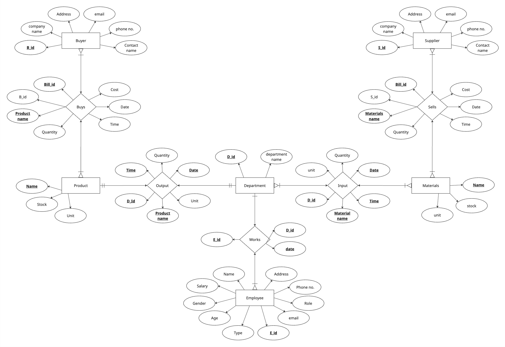
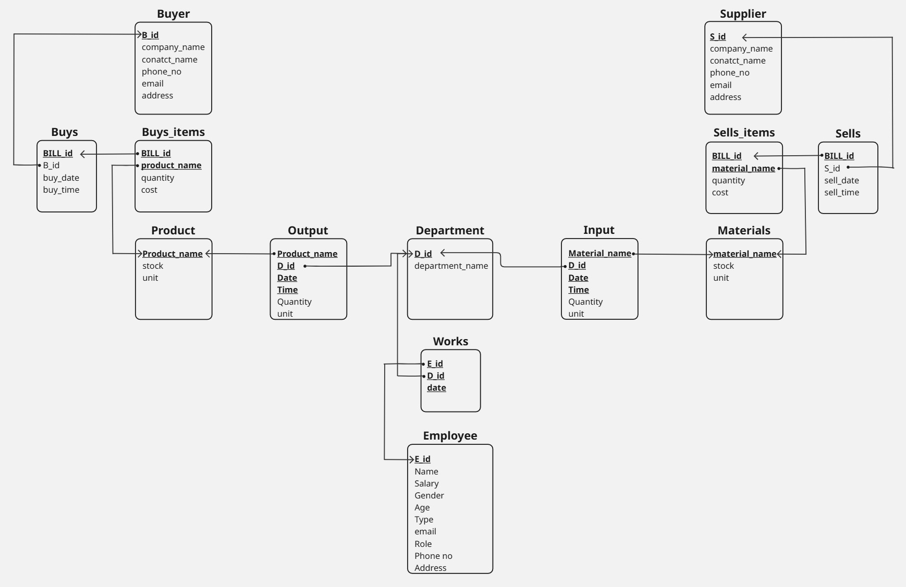

# Integrated Business System (DBMS Mini-Project)

This project is a comprehensive, cross-platform desktop application designed to manage the core operations of a small manufacturing business. It was developed as a final mini-project for our Database Management Systems course, demonstrating a full-stack approach from database architecture to a polished user interface.

The system is built using Electron, Node.js, and a cloud-hosted PostgreSQL database, showcasing a modern and robust technology stack.

---

## Core Features

This application provides a rich user experience with full CRUD (Create, Read, Update, Delete) functionality for all major business entities, sophisticated transaction management, and insightful data visualization.

- **Dynamic Dashboard**: The application opens to a live dashboard displaying key business metrics like employee counts, product varieties, and items low on stock. It also features a real-time "Recent Activity" feed showing the latest transactions.

- **Comprehensive Entity Management**:
    - **Employees**: A complete module to manage all employee records, including personal details, roles, and salary.
    - **Inventory**: A tabbed interface to manage both finished **Products** and raw **Materials**, including stock levels and units.
    - **Contacts**: A unified, tabbed view for managing both **Suppliers** and **Buyers**.
    - **Departments**: A simple interface to manage company departments.

- **Advanced Transaction System**:
    - **New Transaction View**: A dedicated, multi-tabbed interface for recording core business operations:
        - **Sells (Purchases)**: Record the purchase of raw materials from suppliers, which automatically increases material stock.
        - **Buys (Sales)**: Record the sale of finished products to buyers, which automatically decrements product stock and enforces non-negative inventory constraints.
        - **Production**: Log internal production runs, consuming materials and creating products, with automatic stock adjustments for both inventories.
    - **Transaction History**: A separate, filterable view that provides a complete log of all past purchases, sales, and production runs, allowing for easy auditing and review.

- **Professional UI/UX**:
    - **Live Search**: All major table views (Employees, Suppliers, etc.) include a live search bar for instant filtering.
    - **Custom Modals**: All data entry and confirmations are handled through a consistent, professional modal system, replacing native browser dialogs.
    - **Resilient Connectivity**: The application is designed to handle potential network instability with a cloud database, featuring automatic connection retries and user-friendly error reporting.

---

## Technology Stack

- **Application Framework**: Electron
- **Frontend**: HTML5, CSS3, Vanilla JavaScript (ES6+)
- **Backend Runtime**: Node.js
- **Database**: PostgreSQL (Cloud-hosted via Neon)
- **Database Driver**: `node-postgres` (`pg`)

---

## Database Schema (ER Diagram)


## Database Schema (Relational Diagram after Normalization)



---

## Local Setup & Installation

To run this project locally, you will need **Node.js** installed on your system.

1.  **Clone the repository:**
    ```bash
    git clone https://github.com/srinith-nangunoori/Integrated-Business-System
    ```
2.  **Navigate into the project directory:**
    ```bash
    cd Integrated-Business-System
    ```
3.  **Install all dependencies:**
    ```bash
    npm install
    ```
4.  **Configure the Database Connection:**
    - In the `src/js/` directory, create a new file named `dbConfig.js`.
    - This file is listed in `.gitignore` and must be created manually to protect sensitive credentials.
    - Add the following content, replacing the placeholder with your PostgreSQL database connection string:
    ```javascript
    module.exports = {
      connectionString: "YOUR_POSTGRES_CONNECTION_STRING_HERE"
    };
    ```
5.  **Run the application in development mode:**
    ```bash
    npm start
    ```

---

## Authors

- **Srinith Nangunoori** - https://github.com/srinith-nangunoori
- **Gelivi Naga Datheswara kumar** - https://github.com/gelividathu
